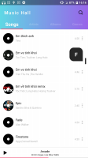
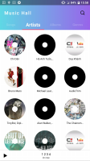
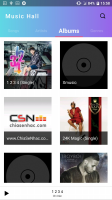
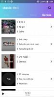
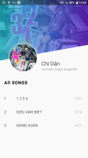

# MusicHall
This app load song from local.
Features:
+Filter songs by name artist album and genres
+Control song in notification and next, previous, shuffle and repeat.
+Audio effect with Bassboost, Virtualizer and Pre-set

Intro images


# MusicHall 🎵

MusicHall is a simple Android music player app that lets you load songs from local storage.  
It supports filtering songs by name, artist, album, or genre, and offers playback controls (play / pause / next / previous / shuffle / repeat).  
You can also apply audio effects such as Bass Boost, Virtualizer, and built-in presets.  

## 📸 Preview

  
  
  
  
  
… (add as many preview images as you like) …

---

## 🧰 Features

- Load songs from local storage  
- Filter songs by **name**, **artist**, **album**, or **genre**  
- Playback controls: **Play / Pause / Next / Previous / Shuffle / Repeat**  
- **Notification control**: manage playback from the notification panel  
- Audio enhancements: **Bass Boost**, **Virtualizer**, and built-in **presets**  
- Simple, clean UI  

## 🚀 Getting Started / Installation

1. Clone the repository  
   ```bash
   git clone https://github.com/VietDuongWorking/music-hall.git
   cd music-hall
